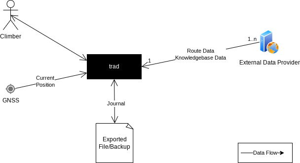
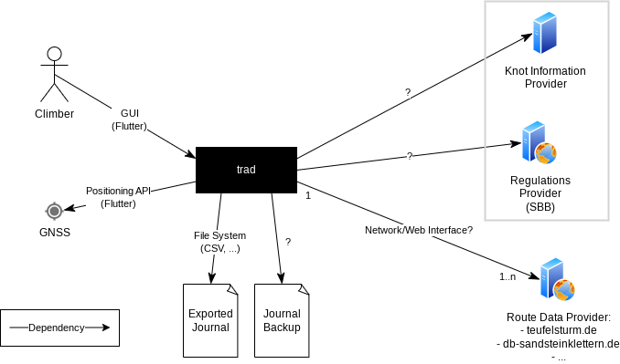
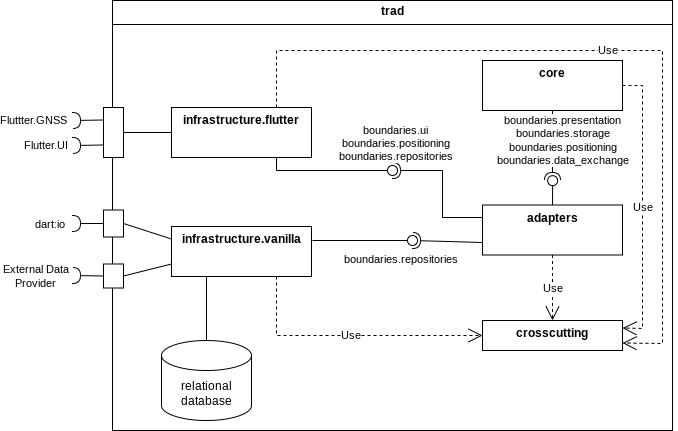
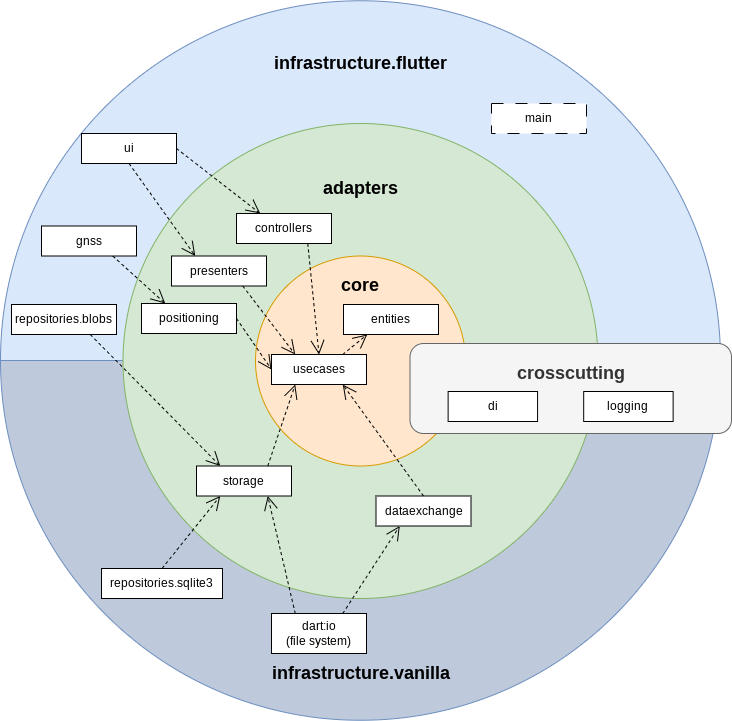

Architecture Documentation
==========================

This is the documention of the architectural views and decisions of the trad application. Its
structure is based on the [Arc42](https://arc42.org/overview) documentation template, please follow
this template if appropriate when modifying.

# 1. Introduction and Goals

## 1.1 Requirements Overview

Mobile (Android) app providing some handy tools for climbers in the Saxon Switzerland area:
 - Personal climbing journal
 - Climbing route database including community ratings and remarks (based on external sites)
 - Knowledgebase providing useful information (e.g. knot database, climbing regulations)

All of these tools can be used without a working internet connection.

Please refer to [Requirements & Goals](requirements.md) for further information about functional
requirements.

## 1.2 Quality goals

The most important quality properties are from
the maintainability/flexibility and reliability areas: In the long run, the developers prefer to
spend the majority of the project time on feature development, not on maintaining tasks. Users
want to rely on our app functionality under different circumstances and over a long time.

The top three quality goals:

| No. | Quality Goal | Scenario |
|-----|--------------|----------|
| 1 | Maintainability | It must be possible to implement new/changed features without interfering with exiting code more than necessary and with a minimum amount of necessary manual testing. |
| 2 | Reliability | All use cases that do not directly depend on some external connection, must work completely without any network connectivity. |
| 3 | Reliability | Each future version must support the import of journal data exported from a previous version. |

Please refer to [section 10](#10-quality-requirements) for further information about quality requirements.

## 1.3 Stakeholders

| Stakeholder       | Contact    | Expectations
|-------------------|------------|-------------
| Developer, Project Owner | Headbucket | Get an overview of the large/basic structures and parts of the system.
| Developer, Architect | Aardjon | Create a full software architecture (+documentation) "the right way" to get some experience.
| User | ??? |
| External Operator | ??? |

# 2. Architecture Constraints

## 2.1 Financial budget

As we are doing this in our free time and without anyone paying for the app, we do not want to
spent valuable amounts of money for development and/or operation.

## 2.2 Time budget

Because this is a hobby project, there is no strict time schedule to provide certain features
and no pressure to maintain a certain release date. On the other hand, we want to keep time
overhead for things like consultations or software maintenance as low as possible to concentrate
on feature development.

## 2.3 Learning and fun as decision criteria

Some decisions may not be purely based on technical needs or requirements but also on the
opportunity to learn something new or to have fun using a certain software. So these are valid
decision criteria for this project.

## 2.4 Limited network access

In the mountains there often is no or very low internet access. That's why the mobile app must
not depend on a working internet connection for regular operation.

## 2.5 Privacy protection

When handling personal data (if any) we have to conform to the german/EU privacy laws. Journal
data must be kept locally.

## 2.6 Copyright concerns

Mirroring data from external sites may touch copyright regulations that need to be respected.

## 2.7 Licenses

We have to decide for a licence before publishing anything. The first open question is whether
to publish as FLOSS or not. The chosen licence also influences technologies and third-party
libraries we can use.

To keep the door open for publishing on F-Droid later on, trad and all its dependencies must be
licensed as FLOSS (free, libre and open source software).

# 3. Context and scope

## 3.1 Business context

The following diagram shows the system context and the data flows to and from external entities.

## 3.2 Technical context

The following diagram shows the dependencies between *trad* and external systems, along with the
interfaces we plan or expect to use.

# 4. Solution Strategy

This section describes our solution strategies for the quality goals. Please refer to
[section 10](10-quality-requirements) for their descriptions.

The mobile app will be written in [Dart 3](https://dart.dev/), mainly because we want to learn
this language. The scraper part will be implemented in Python, mainly because of the availability
of very useful third-party packages. We are aware of the negative impact Python may have on some of
our quality goals (mainly QREQ-2), but we are optimistic that the scraper will stay small enough
and that we can compensate it.

We are using [Git](https://github.com/Headbucket/trad) for version control, all software parts are
stored in a single [Github repository](https://github.com/Headbucket/trad) (monorepo). The reasons
for choosing certain external packages are documented in [External Package Evaluations](../external_packages.md).

## 4.1 Flexibility, Maintainability, Testability (QREQ-1, QREQ-2, QREQ-3, QREQ-6)

To support these most important quality properties, the Clean Architecture pattern published by
Robert C. Martin is used because it focuses on them and is said to fit well with agile
development. However, we omit the innermost ring (`entities`) because there is no company domain
in this project. The entities can be put into a separate component within the `core` ring
instead (which also allows to easily move them if we decide to add the ring in the future).

During implementation it is generally encouraged to apply good design
principles like SOLID and make use of common design patterns where applicable. It may also be a
good idea to follow the Clean Code principles and guidelines. In general, it is recommended to
use OOP as many of the former principles and patterns are probably easier to use then.

To minimize manual testing effort we aim for a high unit test coverage. Test Driven Development
can be a way to achieve this.

We are using static analysis tools to maximize automated support. We start with a very pedantic
configuration and always document the reason for disabling single checks. This documentation is
embedded into the linter configuration files (see [1](../mobileapp/analysis_options.yaml) and
[2](../scraper/pyproject.toml)) to make it easy to update in case of changes.

Resources:
 - [The Clean Architecture](https://blog.cleancoder.com/uncle-bob/2012/08/13/the-clean-architecture.html)
 - [A primer on the clean architecture pattern and its principles](https://www.techtarget.com/searchapparchitecture/tip/A-primer-on-the-clean-architecture-pattern-and-its-principles)
 - [Summary of Uncle Bobs book](https://github.com/serodriguez68/clean-architecture/tree/master)
 - [Clean Code Developers](https://clean-code-developer.com/)
 - [Test-driven development](https://en.wikipedia.org/wiki/Test-driven_development)

## 4.2 Reliability, Usability (QREQ-3)

To ensure no critical use cases of the mobile app depend on any network connection, all necessary
data (e.g. route data, journal) is replicated to/stored within the local device. The business core
works on this local copy only.

By separating the actual route data source access into a separate scraper application (see also
[ADR-3](#93-adr-3-decouple-the-mobile-app-from-external-route-data-services)), the mobile app
becomes independent from any external problems or changes, increasing both reliability and
usability.

## 4.3 Reliability, Durability (QREQ-4)

For ensuring future compatibility of exported journal data, the `data import` component is
highly decoupled from the business core so that it is possible to provide several different
importer implementations and choose between them on runtime. This can be implemented e.g. with
the Strategy design pattern. On every incompatible export format change we then have the option
to simply create a new importer component and keep the previous one as-is. Furthermore, we
create automatic tests for importing data of old formats.

Of course, the export format must still be very stable and flexible, to reduce the amount of
incompatible format changes to a minimum.

## 4.4 Compliance, Security (QREQ-5, QREQ-10, QREQ-12)

In general, compliance with laws has to be considered by the (functional) requirements
already: Just don't implement components that send any data to external sites without explict
user confirmation, and collect only the minimal data needed by the use cases. Of course we don't
use any possibly unwanted tracker tools, which may be proven by integrating tools like
[Exodus Privacy](https://exodus-privacy.eu.org/) into the release process. At some point we have
to decide for a software license which may influence which third-party libraries can be used. If
we decide for some FLOSS license, we automatically provide transparency about collected data and
data flows.

Copyright mainly regards external site data (e.g. route or regulation data). In case the license
for using this data is unclear, we will request the external provider for explicit permission
and/or license clarification.

## 4.5 Adaptability, Transferability (QREQ-7, QREQ-15)

The usage of the [Clean Architecture](#41-flexibility-maintainability-testability-qreq-1-qreq-2-qreq-3-qreq-6)
pattern and consistent decoupling and encapsulating details also supports us in adapting to
external changes or different platforms. Additionally, we use the [Flutter 3](https://flutter.dev/)
framework on the mobile app part for GUI and hardware abstraction because it allows to easily
transfer the app to different platforms. However, Flutter itself shall be kept an implementation
detail and therefore only be used within the `infrastructure` ring.

To decouple the mobile app from interface changes on the external data sources, a separate
`scraper` application access them and prepares the data for the app (see also
[ADR-3](#93-adr-3-decouple-the-mobile-app-from-external-route-data-services)). The scraper is
implemented in Python to make it easy to run it on different platforms.

## 4.6 Security (QREQ-11)

To prevent against data loss or corruption in case of errors or power-loss, the mobile app uses
some transaction-based system for storing the journal data. The UI must make it very clear to the
user before deleting any data from the journal (e.g. by an explicit confirmation). To prevent
against data loss when uninstalling the app or removing the app data, it is also possible to export
the journal data for a backup. But the data must not be exported automatically without the users
knowledge (see [4.4 Compliance, Security](#44-compliance-security-qreq-5-qreq-10-qreq-12)).

When connecting to any external site (e.g. for route data upgrade), its identity shall be
validated before loading data (e.g. by using HTTPS) to reduce the risk of MITM attacks. There will
also be plausibility and/or checksum tests for downloaded data.

# 5. Building Block View

## 5.1 Level 1

### 5.1.1 Motivation

On the upper level, the system is split into the two independent parts running in different
environments, as discussed with [ADR-3](#93-adr-3-decouple-the-mobile-app-from-external-route-data-services).

### 5.1.2 System parts

#### `mobileapp`

This (bigger) part contains the mobile application the user interacts with. It runs on an end-users
mobile device and implements most use cases.

#### `scraper`

This (smaller) part is a command line tool for collecting route data from all external sites and
for creating a route database that can be imported into the mobile app. It runs on a separate
machine like a local workstation or as part of a CI service. This part is only relevant for some
of the *route database* use cases.

### 5.1.3 Source Locations

- Mobile app: [mobileapp](../mobileapp/)
- Scraper: [scraper](../scraper/)

### 5.1.4 Interface Documentation

The `scraper` produces a single route database file which can then be published or moved to a
mobile device. The `mobileapp` imports this file, replacing the previous route database. So the
interface between the two parts is defined by the file format and schema of the route database,
which is documented in [Schema of the Route Database](sql_schemes/routedb/dbdiagram.io).

## 5.2 Level 2: Common Considerations

### 5.2.1 Clean Architecture Overview

Both parts utilize the *Clean Architecture* pattern, as described in
[section 4.1](#41-flexibility-maintainability-testability-qreq-1-qreq-2-qreq-3-qreq-6). So they are
both separated into at least the following three sub systems:

- core
- adapters
- infrastructure

As an example, the following diagram provides an overview of the mobile app architecture, which
shows the basic concept of rings but is refined and explained more detailled in separate documents.
Arrows are source code dependencies.

The general rules for source code dependencies are:
 - The most important and most abstract code is inner most
 - All details are on the outside
 - Inter-ring (source) dependencies are only allowed from the outer to inner rings
 - All rings may depend on the `crosscutting` part
 - Each ring declares the interfaces it needs to interact with the next outer ring (dependency inversion)
 - In general, each ring shall depend on the next inner ring only (e.g. `infrastructure` shall not depend on `core` components)
 - In general, top-level components within a single ring shall not depend on each other in most cases (there may be exceptions for `common`/`util` components)
 - Each call/event/"input" starts at the `infrastructure` ring (e.g. UI) and has to go down to a `core` usecase (no shortcuts are allowed)

### 5.2.2 Similarities

To be easier to understand and maintain, both parts shall use the same or at least similar concepts
for similar things:

 - Use the same basic pattern in both architectures
 - Use the same names for the same things (e.g. a UI boundary interface)
 - Implement components doing more or less the same (e.g. a library abstraction) in a similar way

Directly reusing components is not possible because of the different programmig languages being used.

### 5.2.3 Common System Parts

#### `core`

This part contains all business entities and implements all business logic (use cases) on an
abstract level. It also defines the interface ("boundary") to the `adapters` ring.

Implementation Rules:
 - Contains all domain specific data types the system works with
 - Contains all use case implementations
 - No technical details (independent from specific hardware or certain implementation details)
 - No dependencies to external interfaces of any kind (IO, UI)
 - If possible, only pure language features (some std libs may be allowed, though)

#### `adapters`

This part provides gateway implementations for connecting the `core` with `infrastructure`
interfaces, and for managing and controlling the necessary `infrastructure`. It is responsible for
retrieving/collecting data from the `infrastructure` parts and converts its structure into the data
structures needed by the `core`. It also defines the interface ("boundary") to the
`infrastructure` ring.

Examples for adapter responsibilities:
 - Defining or translating a string being displayed to the user
 - Formatting dates or numbers into the users preferred string representation
 - Knowledge about the schema of a relational database (but still independent of a certain DBMS!)
 - Deciding which DB query to run on which table and parameterizing it
 - Converting a query result set (rows) into the `core`s entity objects
 - Choosing between different `infrastructure` implementations at runtime

Implementation Rules:
 - No business logic
 - If possible, only pure language features without usage of external lib (some std libs may be allowed)
 - No technical details (independent from specific hardware or certain implementation details)
 - No direct dependencies to external interfaces of any kind (IO, UI)
 - One adapter implementation may access more than one infrastructure boundary to retrieve data

#### `infrastructure`

This part contains all concrete implementations and all technical details. In general, this part provides
a customized, generic interface for each external library which makes it possible (or at least easier) to
replace this library in the future if necessary. The special `main` component is considered a part of the
infrastructure, too.

Examples:

 Responsible? | Example
----------|--------------------------------
  ✔️ | Everything that requires *Flutter*
  ✔️ | A package requiring `dart:io` imports
  ✔️ | Actually executing SQL statements
  ✔️ | Generic, SQLite specific database repository (schema agnostic)
  ✔️ | Platform specific code or hardware abstraction
  ✖️ (`adapters`) | Display strings/i18n
  ✖️ (`adapters`) | A concrete table name to query in a certain situation
  ✖️ (`core`) | The decision whether a certain button must be disabled
  ✖️ (`core`) | Trigger a switch to another UI screen/page after a user action

Implementation rules:
 - No business logic
 - In general: As less code and as less condition checks as possible
 - In general: "This ring shall be as dumb as possible"
 - All third party/external libs are allowed as needed

#### `crosscuttings`

This part contains special components providing very generic, reusable functionality that are meant to be
used directly from everywhere. All other rings may depend on it directly.

The crosscutting components are described more detailed in [section 8](#8-crosscutting-concepts).

Implementation rules:
 - May use external libraries except for the ones that are explicitly encapsulated by the `infrastructure` component.
 - External dependencies must be completely encapsulated to make it easy to update/replace them if necessary

 
## 5.3 Further Refinement

The further refinement of the two first-level system parts is documented in separate places:
 - [Mobile App](architecture/mobileapp.md)
 - [Scraper](architecture/scraper.md)

# 6. Runtime View

## 6.1 Control flow between rings

Control flow usually starts at the `adapters` or `infrastructure` ring and has to go down all
the way to a `core` use case. Shortcuts are not allowed.

The following diagram shows an example control flow for adding a new journal entry.

# 8. Concepts

## 8.1 Dependency Injection (DI)

Provides the central mechanism for mapping interfaces (e.g. boundaries) to their concrete
implementations.

The source code is located at [crosscuttings/lib/di.dart](../mobileapp/crosscuttings/lib/di.dart)
(Dart) and [trad/crosscuttings/di.py](../scraper/src/trad/crosscuttings/di.py) (Python). The
reasons for choosing certain external packages are documented in
[External Package Evaluations](external_packages.md#crosscutting_concepts).

### 8.1.1 Use Cases

 - Get implementation for a certain interface (literally everywhere)
 - Assign concrete implementation factories to interfaces (only once during startup by `main`)
 - Allow a clean "shutdown", deleting all assignments (only once from `main`)

### 8.1.2 Component Interface

## 8.2. Synchronizing the route database schema

The schema of the route database must be known to both the mobile app (for reading) and the scraper
(for writing). When changing the schema, the database adapter of both parts must be updated. To
make this simpler and less error-prone, the database schema is defined in a single place only: The
[dbdiagram.io](sql_schemes/routedb/dbdiagram.io) DBML file. Python and Dart source files for
accessing concrete DB entities are generated from [templates](sql_schemes/routedb/jinja_templates)
using [a tool](devtools.md#generate-schema-generate-db-schema-sources), to avoid accidential
mismatches between both parts. The adapter code then still needs a lot of knowledge about the
schema, but any incompatibilities will usually cause obvious errors.

So the generated source files must never be edited directly, but only ever by the code generator.
To change the schema, update the DBML file. To modify the generated files, modify their templates.

# 9. Architecture Decisions

## 9.1 ADR-1: How to integrate Flutter into the architecture?

### Context
Flutter as a framework should be considered an implementation detail, much like any other external
package. However, because of its size and importance it has a much bigger impact on the code and
software structure. Following the Clean Architecture pattern, everything that has to do with
Flutter must still be limited to the outer (`infrastructure`) ring, to strictly separate it from
any business logic and to be able to update or replace the framework in the future if necessary.
Only the software parts that really need Flutter shall be able to access (import) from it.

### Decision

The `adapters` ring provides a generic, Flutter independent interface to the services that are
implemented using Flutter (e.g. UI, Positioning, platform specific information). Their
implementation within the `infrastructure` ring may import and use Flutter services normally. In
addition, the `infrastructure` ring is split into two parts: The Flutter one and the Non-Flutter
("vanilla") one, from which only the Flutter one depends on the Flutter framework.

### Status
Accepted (04/2024)

### Consequences
 - Positive:
   - Flutter usage is limited to the places that really need it
   - It's relatively easy to add e.g. alternative UI implementations in the future (e.g. Qt or CLI?)
   - The effort for adapting to new Flutter versions is limited to a single system part
   - In a way this structure encourages strict separation of business logic and details
 - Neutral:
   - Developers need a more advanced knowledge of Flutter to do things "right" (e.g. implementing a proper
    [state management](https://docs.flutter.dev/data-and-backend/state-mgmt/intro) instead of just using a
    [StatefulWidget](https://api.flutter.dev/flutter/widgets/StatefulWidget-class.html))
 - Cons:
   - Many "see how easy you can get started" tutorials do not work because they don't separate UI from business
   - Probably more work to implement the UI

## 9.2. ADR-2: Single flutter project or multiple sub-projects?

### Context

The architecture should be represented as good as possible in the source code and project
structure. The main goals are:
 - Architectural entities should more or less directly map to certain file system/source entities (e.g. packages)
 - Accidential usage of invalid dependency relations should be detected and prohibited as early as possible

### Decision

The mobile app project is split into several sub-projects (i.e. Dart and Flutter packages) that are
managed by [`melos`](https://melos.invertase.dev/). All of these sub-projects are stored within one
source code repository, though.

There is one Dart package for each level 1 part of the software (i.e. the `core`, `crosscuttings`
and `adapters` rings). Because the `infrastructure` ring is split (see
[ADR-1](#91-adr-1-how-to-integrate-flutter-into-the-architecture)), there is a Dart package
`infrastructure_vanilla` and a Flutter package `infrastructure_flutter` for it. Furthermore, `main`
is the actual Flutter application which ties everything together (but doesn't contain much code).

### Status
Accepted (04/2024)

### Consequences

Positive:
 - Inter-ring dependency rules are enforced automatically
 - Dependencies to external libraries are enforced automatically
 - Explicit dependency definition for each package makes it easy to find out what may be used there
 - Source directory stays clean, because the Flutter platform stuff is hidden inside the `main` project

Neutral:
 - Unsure about IDE support and setup

Con:
 - Need separate tooling for managing the subprojects (e.g. `melos`)
 - Combining subprojects' metrics can be complicated
 - Some tool configuration may be duplicated

### Considered Alternatives

The alternative would be one big, single Flutter project.

Positive:
 - Easy to gather complete metrics (e.g. test coverage, linter reports)
 - Single source of truth for tool configuration
 - Can simply use `flutter` CLI command (+ IDE tools etc.),

Con:
 - We need a separate mechanism to enforce the dependency rules (may some linter rule?)
 - Allowed dependencies and violations are not as obvious
 - Flutter directory structure pollutes the source root
 - Much more difficult to build a non-Flutter variant in the future

## 9.3 ADR-3: Decouple the mobile app from external route data services

### Context
The mobile app needs to import the summit and route data from various online sources (see also
[route database requirements](requirements.md#21-list-of-climbing-routes-in-the-saxon-switzerland-area))
beyond our control. External interfaces may change at any time (note: there are no machine readable
APIs, we have to parse the HTML). Their operators may not like too much additional traffic from our
apps. Preparing the imported data for mobile app usage may be a complex task in some cases. Rolling
out a new version of the mobile app to AppStores can take from some days up to several weeks.

### Decision
Put a facade/cache component ("scraper") in between to fully decouple the mobile app from external sources.
The system is split into two parts:
 - A `scraper` service imports the external data from time to time and creates optimized, working route databases
 - The `mobile app` just downloads and imports the prepared route database

See [section 5.1](#TODO) for a building block figure.

### Status

Accepted (09/24)

### Consequences

 - Positive:
   - Mobile app can update independently from the status (disruptions?) of external sites
   - On external interface change, only the scraper needs to be adapted (no app update)
   - It can be made possible to add or remove external sources without having to roll out a new app version
   - Additional traffic on external sites is kept as low as possible
   - External site load does not increase with increasing number of mobile app users
   - Data update can be scheduled centrally in cooperation with the external operators, if necessary
   - Offline database preparation allows more expensive optimization and validation as there are looser performance restrictions
   - Can be made very easy for users (i.e. automatically downloading/updating the route DB)
   - The most resource and energy efficient solution
   - In general:
     - Improves maintainability, reliability, extensibility and scalability
     - Embarks the risks coming from the dependency to external services

 - Negative:
   - We need some web service for running the scraper
   - We need some web storage for providing the prepared database files
   - May cause copyright problems because we are publicly sharing a copy of the data
   - We have to provide a stable interface between the mobile app and the scraper (increased development effort) 

### Considered Alternatives

#### 1. Let the mobile app import route data directly from external sites
   - Positive:
     - No copyright issues
     - No web storage/service needed
   - Negative:
     - External interface/web site changes (beyond our control!) may cause problems in the mobile app
     - Some expensive database operations/optimizations may not be possible on mobile devices due to their runtime
     - May cause quite a lot of additional traffic on external sites with increasing numbers of app users (doesn't scale)

#### 2. Let the users run the scraper by themselves
   - Positive:
     - No web storage/service needed
     - On external interface change, only the scraper needs to be adapted (no app update)
     - Offline database preparation allows more expensive optimization as there are looser performance restrictions
     - (Probably) no copyright issues
   - Negative:
     - May cause unwanted additional traffic on external sites
     - The scraper must be an end user piece of software, which increases the development effort
     - App setup gets quite complicated (users have to run the scraper on a PC and then copy some file onto their mobile)

A future switch between the proposal and alternative #2 should be relatively easy.

# 10. Quality Requirements

These are the quality requirements we explicitly want to fulfil as good as possible, ordered by
priority ("1" being "most important"):

 ID | Prio | Quality Properties | Requirement
----|------|--------------------|-------------------------
QREQ-1  | 1 | Flexibility, Maintainability | It shall be easy to implement new/changed use cases/features without interfering with exiting code more than necessary.
QREQ-2  | 1 | Maintainability, Testability | The necessity for manual testing (e.g. regressions tests) must be kept as low as possible.
QREQ-3  | 1 | Reliability, Usability | All "in the mountains" use cases must be fully functional without any network connection.
QREQ-4  | 1 | Reliability, Durability | (Exported) journal data shall be importable by any future application version.
QREQ-5  | 1 | Compliance | It must comply with all (german) laws (esp. copyright and privacy). [Exodus Privacy](https://exodus-privacy.eu.org/en/) shall not report any findings.
QREQ-6  | 2 | Maintainability | It shall be possible to upgrade external dependencies with as less effort as possible.
QREQ-7  | 2 | Adaptability | It shall be possible to adopt to changes of external interfaces with as less effort as possible.
QREQ-8  | 2 | Compliance, Performance | Data from external interfaces must only be requested if really necessary (to keep their traffic as low as possible).
QREQ-9  | 2 | Compliance, Performance | The traffic on external interfaces shall not increase with the number of app users.
QREQ-10 | 2 | Compliance, Security | Personal data must always be saved locally and only exported/uploaded with explicit agreement.
QREQ-11 | 2 | Security | Journal data must be handled very sensitively and it must be prevented at all costs that it is accidentally deleted.
QREQ-12 | 3 | Security | The app shall only request the permissions that are really needed by the use cases.
QREQ-13 | 3 | Usability | Device permissions shall only be requested when they are needed (first time).
QREQ-14 | 4 | Security, Usability | A denied permission must not prevent use cases that do not depend on it.
QREQ-15 | 4 | Transferability | It shall be easily possible to add a new destination platform.

# 12. Glossary

## 12.1 Important terms

- Ban: Legal prohibition to climb on a certain summit (or route), usually temporarily due to nature protection.
- Boundary: A special component which acts as the interface from one architectural ring to the next outer ring (e.g `core` to `adapters`).
- Technical grade: Difficulty of a climbing route, measured e.g. with UIAA or Saxon scale.
- Adjectival grade: This gives an overall picture of the route including how well protected it is.
- Knowledgebase: Encyclopaedia with climbing related information, e.g. regulations or knots.
- Route: The path by which a climber reaches the top of a mountain.
- Summit: The destination of a climbing route, usually the highest point of a single rock or mountain.

## 12.2 Translations

|  English             |  German                   |
|----------------------|---------------------------|
| Technical grade      | Schwierigskeitsgrad       |
| Adjectival grade     | Ernsthaftigkeitsbewertung |
| Journal              | Logbuch / Fahrtenbuch     |
| Climbing ban         | Gipfelsperrung            |
| Climbing regulations | Kletterregeln             |
| (Climbing) Route     | Kletterweg                |
| Summit               | Gipfel                    |
