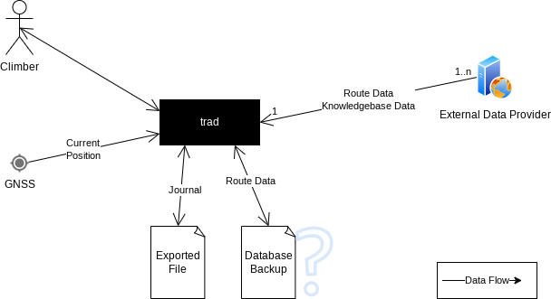
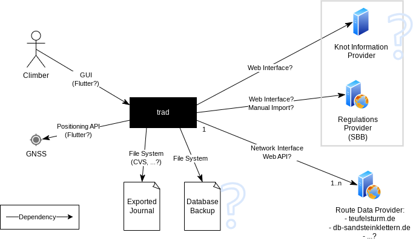

Architecture Documentation
==========================

This documents the architectural views and decisions of the trad application. Its structure is based on the [Arc42](https://arc42.org/overview) documentation template, please follow this template if appropriate when modifying.

# 1. Introduction and Goals

## 1.1 Requirements Overview

Mobile (Android) app providing some handy tools for climbers in the Saxon Switzerland area:
 - Personal climbing journal
 - Climbing route database including community ratings and remarks (based on external sites)
 - Knowledgebase providing useful information (e.g. knot database, climbing regulations)

All of these tools can be used without a working internet connection.

Please refer to [Requirements & Goals](requirements.md) for further information about functional
requirements.

## 1.2 Quality goals

The most important quality properties are from
the maintainability/flexibility and reliability areas: In the long run, the developers prefer to
spend the majority of the project time on feature development, not on maintaining tasks. Users
want to rely on our app functionality under different circumstances and over a long time.

The top three quality goals:

| No. | Quality Goal | Scenario |
|-----|--------------|----------|
| 1 | Maintainability | It must be possible to implement new/changed features without interfering with exiting code more than necessary and with a minimum amount of necessary manual testing. |
| 2 | Reliability | All use cases that do not directly depend on some external connection, must work completely without any network connectivity. |
| 3 | Reliability | Each future version must support the import of journal data exported from a previous version. |

Please refer to [section 10](#10-quality-requirements) for further information about quality requirements.

## 1.3 Stakeholders

| Stakeholder       | Contact    | Expectations
|-------------------|------------|-------------
| Developer, Project Owner | Headbucket | Get an overview of the large/basic structures and parts of the system.
| Developer, Architect | Aardjon | Create a full software architecture (+documentation) "the right way" to get some experience.
| User | ??? |
| External Operator | ??? |

# 2. Architecture Constraints

## Financial budget

As we are doing this in our free time and without anyone paying for the app, we do not want to
spent valuable amounts of money for development and/or operation.

## Time budget

Because this is a hobby project, there is no strict time schedule to provide certain features
and no pressure to maintain a certain release date. On the other hand, we want to keep time
overhead for things like consultations or software maintenance as low as possible to concentrate
on feature development.

## Learning and fun as decision criteria

Some decisions may not be purely based on technical needs or requirements but also on the
opportunity to learn something new or to have fun using a certain software. So these are valid
decision criteria for this project.

## Limited network access

In the mountains there often is no or very low internet access. That's why the mobile app must
not depend on a working internet connection for regular operation.

## Privacy protection

When handling personal data (if any) we have to conform to the german/EU privacy laws. Journal
data must be kept locally.

## Copyright concerns

Mirroring data from external sites may touch copyright regulations that need to be respected.

## Licenses

We have to decide for a licence before publishing anything. The first open question is whether
to publish as FLOSS or not. The chosen licence also influences technologies and third-party
libraries we can use.

To keep the door open for publishing on F-Droid later on, trad and all its dependencies must be
licensed as FLOSS (free, libre and open source software).

# 3. Context and scope

## 3.1 Business context

The following diagram shows the system context and the data flows to and from external entities.

## 3.2 Technical context

The following diagram shows the dependencies between *trad* and external systems, along with the
interfaces we plan or expect to use.

# 4. Solution Strategy

This section described our solution strategies for the quality goals. Please refer to
[section 10](10-quality-requirements) for their descriptions.

The mobile app will be written in [Dart 3](https://dart.dev/), mainly because we want to learn
this language. We are using [Git](https://github.com/Headbucket/trad) for version control.

## 4.1 Flexibility, Maintainability, Testability (QREQ-1, QREQ-2, QREQ-3, QREQ-6)

To support these most important quality properties, the Clean Architecture pattern published by
Robert C. Martin is used because it focuses on them and is said to fit well with agile
development. However, we omit the innermost ring (`entities`) because there is no company domain
in this project. The entities can be put into a separate component within the `core` ring
instead (which also allows to easily move them if we decide to add the ring in the future).

During implementation it is generally encouraged to apply good design
principles like SOLID and make use of common design patterns where applicable. It may also be a
good idea to follow the Clean Code principles and guidelines. In general, it is recommended to
use OOP as many of the former principles and patterns are probably easier to use then.

To minimize manual testing effort we aim for a high unit test coverage. Test Driven Development
can be a way to achieve this.

Resources:
 - [The Clean Architecture](https://blog.cleancoder.com/uncle-bob/2012/08/13/the-clean-architecture.html)
 - [A primer on the clean architecture pattern and its principles](https://www.techtarget.com/searchapparchitecture/tip/A-primer-on-the-clean-architecture-pattern-and-its-principles)
 - [Clean Code Developers](https://clean-code-developer.com/)
 - [Test-driven development](https://en.wikipedia.org/wiki/Test-driven_development)

## 4.2 Reliability, Usability (QREQ-3)

To ensure no critical use cases depend on any network connection, all necessary data (e.g.
route data, journal) is replicated to/stored within the local device. The business core works on
this local copy only.

## 4.3 Reliability, Durability (QREQ-4)

For ensuring future compatibility of exported journal data, the `data import` component is
highly decoupled from the business core so that it is possible to provide several different
importer implementations and choose between them on runtime. This can be implemented e.g. with
the Strategy design pattern. On every incompatible export format change we then have the option
to simply create a new importer component and keep the previous one as-is. Furthermore, we
create automatic tests for importing data of old formats.

Of course, the export format must still be very stable and flexible, to reduce the amount of
incompatible format changes to a minimum.

## 4.4 Compliance, Security (QREQ-5, QREQ-10, QREQ-12)

In general, compliance with laws has to be considered by the (functional) requirements
already: Just don't implement components that send any data to external sites without explict
user confirmation, and collect only the minimal data needed by the use cases. Copyright mainly
regards external site data (e.g. route or regulation data). In case the license for using this
data is unclear, we will request the external provider for explicit permission and/or license
clarification.

At some point we have to decide for a software license. This decision may influence which
third-party libraries can be used. If we decide for some FLOSS license, we automatically provide
transparency about collected data and data flows.

## 4.5 Adaptability, Transferability (QREQ-7, QREQ-15)

The usage of the [Clean Architecture](#41-flexibility-maintainability-testability-qreq-1-qreq-2-qreq-3-qreq-6)
pattern and consistent decoupling and encapsulating details also supports us in adapting to
external changes or different platforms. Additionally, we use the [Flutter 3](https://flutter.dev/)
framework for GUI and hardware abstraction because it allows to easily transfer the app to
different platforms. However, Flutter itself shall be kept an implementation detail and
therefore only be used within the `infrastructure` ring.

## 4.6 Security (QREQ-11)

To prevent against data loss or corruption in case of errors or power-loss, some
transaction-based system shall be used for storing the journal data. The UI must make it very
clear to the user before deleting any data from the journal (e.g. by an explicit confirmation).
To prevent against data loss when uninstalling the app or removing the app data, it is also
possible to export the journal data for a backup. But the data must not be exported
automatically without the users knowledge (see [4.4 Compliance, Security](#44-compliance-security-qreq-5-qreq-10-qreq-12)).

# 8. Crosscutting Concepts

- (Central) Dependency Injection
- Logging?

# 9. Architecture Decisions

# 10. Quality Requirements

These are the quality requirements we explicitly want to fulfil as good as possible, ordered by
priority ("1" being "most important"):

 ID | Prio | Quality Properties | Requirement
----|------|--------------------|-------------------------
QREQ-1  | 1 | Flexibility, Maintainability | It shall be easy to implement new/changed use cases/features without interfering with exiting code more than necessary.
QREQ-2  | 1 | Maintainability, Testability | The necessity for manual testing (e.g. regressions tests) must be kept as low as possible.
QREQ-3  | 1 | Reliability, Usability | All "in the mountains" use cases must be fully functional without any network connection.
QREQ-4  | 1 | Reliability, Durability | (Exported) journal data shall be importable by any future application version.
QREQ-5  | 1 | Compliance | It must comply with all (german) laws (esp. copyright and privacy). [Exodus Privacy](https://exodus-privacy.eu.org/en/) shall not report any findings.
QREQ-6  | 2 | Maintainability | It shall be possible to upgrade external dependencies with as less effort as possible.
QREQ-7  | 2 | Adaptability | It shall be possible to adopt to changes of external interfaces with as less effort as possible.
QREQ-8  | 2 | Compliance, Performance | Data from external interfaces must only be requested if really necessary (to keep their traffic as low as possible).
QREQ-9  | 2 | Compliance, Performance | The traffic on external interfaces shall not increase with the number of app users.
QREQ-10 | 2 | Compliance, Security | Personal data must always be saved locally and only exported/uploaded with explicit agreement.
QREQ-11 | 2 | Security | Journal data must be handled very sensitively and it must be prevented at all costs that it is accidentally deleted.
QREQ-12 | 3 | Security | The app shall only request the permissions that are really needed by the use cases.
QREQ-13 | 3 | Usability | Device permissions shall only be requested when they are needed (first time).
QREQ-14 | 4 | Security, Usability | A denied permission must not prevent use cases that do not depend on it.
QREQ-15 | 4 | Transferability | It shall be easily possible to add a new destination platform.

# 12. Glossary

## 12.1 Important terms

- Grade: Difficulty of a climbing route, measured e.g. with UIAA or Saxon scale.
- Knowledgebase: Encyclopaedia with climbing related information, e.g. regulations or knots.
- Route: The path by which a climber reaches the top of a mountain.
- Summit: The destination of a climbing route, usually the highest point of a single rock or mountain.

## 12.2 Translations

|  English             |  German             |
|----------------------|---------------------|
| Grade                | Schwierigskeitsgrad |
| Journal              | Logbuch             |
| Climbing regulations | Kletterregeln       |
| (Climbing) Route     | Kletterweg          |
| Summit               | Gipfel              |
