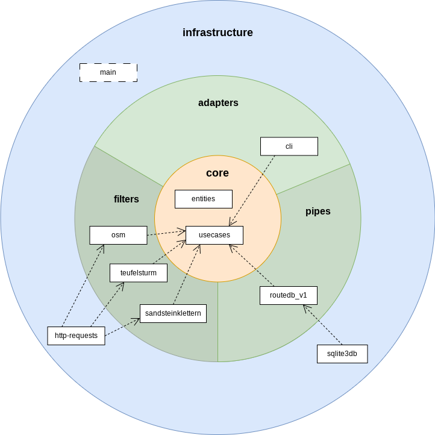
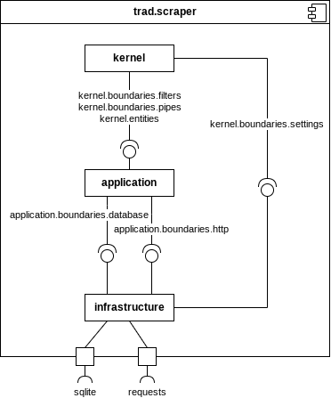

Scraper Architecture Documentation
==================================

This is the documention of the architectural views and decisions of the `scraper` part of the
[trad application](../architecture.md). See there for a system overview and overall documentation.

# 1. Introduction and Goals

## 1.1 Requirements Overview

The scraper application is a command line tool that downloads all the summit related data from
external sources and generates the route database, as shortly described in
[ADR-3](../architecture.md#93-adr-3-decouple-the-mobile-app-from-external-route-data-services).
It is intended to run automated and unattended.

Please refer to [Requirements & Goals](../requirements.md) for further information about functional
requirements.

## 1.2 Different/Additional quality goals

Because the scraper of course depends on a working network connection and does not run on a mobile
device, some quality goals are not relevant for this part of the software. Goals that are
applicable (e.g. Maintenance) still apply, though.

Because the scraper runs unattended anyway, a short runtime (performance) is not a big thing. We
still want to avoid unnecessary waiting times and keep the traffic on external sites at the
absolute minimum, though.

# 3. Building Block View

## 3.1 Level 1

### 3.1.1 Motivation

The scraper is a more or less traditional pipeline processing tool without any user interaction: It
takes input from some sources (mostly web services), processes it and generates some output (e.g. a
route database). Some of these steps depend on each other, others can be run independently. Also,
since some steps may take quite long to complete, we may want to run them in parallel in the
future.

To reflect this way of processing and to keep the door open for future extentions (new steps) as
well as performance improvements (parallelisation), the actual application code is designed using
the [Pipes and Filters](https://www.geeksforgeeks.org/pipe-and-filter-architecture-system-design/)
architectural pattern.

To meet the overall maintainability and testability requirements of the *trad* application, the
scraper is additionally organized in three rings, similar to the ones of the Clean Architecture
pattern (see the mobile app architecture for further information). These rings separate the actual
application code from basic/common functionality as well as its infrastructure. Because their
architectural rules differ a bit from the ones of the mobile app, the rings are named differently
to avoid confusion.

### 3.1.2 System parts

#### kernel

This part provides the basic business entities and implements the abstract use case which controls
the execution and order of the Filter (i.e. the pipeline itself). It also provides the dependency
injection mechanism and defines an interface ("boundary") to the other rings.

In comparison to the mobileapp architecture, the kernel combines the `core` and the `crosscuttings`
rings but does not contain all of the business logic.

Implementation Rules:

 - Contains all domain specific data types the system works with
 - Contains only generic use case implementations
 - No knowledge about the concrete data sources
 - No knowledge about concrete data transition/processing algorithms
 - No knowledge about the output format(s)
 - No technical details (independent from specific hardware or certain implementation details)
 - No dependencies to external interfaces of any kind (IO, UI)
 - Does not depend on the other rings
 - Limited to pure language features and very few std lib and external packages (e.g. for DI)

#### application

This part contains the Pipe and all Filter implementations, and thus probably most of the code. It
may also provide gateway implementations for connecting the kernel with infrastructure interfaces
(`adapters` as of the Clean Architecture pattern), if any. In general, it is responsible for
converting data between the infrastructure parts and the data structures needed by the Pipe or the
kernel. Therefore, it also defines the interface ("boundary") to the infrastructure ring.

Examples for application responsibilities:

 - A Filter implementation
 - Knowledge about the schema of the routedb
 - Converting a JSON response from a web service into the kernel's entity objects

Implementation Rules:

 - All Filters belong here
 - The usage of external packages should be limited to some specific exceptions
 - No direct dependencies to external interfaces of any kind (IO, UI)
 - May depend on the `kernel` ring, but not on `infrastructure`

#### infrastructure

This part contains abstractions of all external packages via a customized, generic interface for
each which makes it possible (or at least easier) to replace this library in the future if
necessary. The special `main` component is considered a part of the infrastructure, too. Contrary to
the mobileapp's infrastructure ring, the scraper's one may also depend on the `kernel` to e.g.
directly implement a kernel boundary or raise kernel exceptions. It doesn't work with business
entities, though.

Implementation rules:

 - No business logic
 - In general: As less code and as less condition checks as possible
 - In general: "This ring shall be as dumb as possible"
 - All third party/external libs are allowed as needed
 - May depend on both the `application` and the `infrastructure` rings

### 3.1.3 Source Locations

 - `kernel`: [scraper/src/trad/kernel](../../scraper/src/trad/kernel)
 - `application`: [scraper/src/trad/application](../../scraper/src/trad/application)
 - `infrastructure`: [scraper/src/trad/infrastructure](../../scraper/src/trad/infrastructure)

### 3.1.4 Interface Documentation

Interface name | Source location
------------|--------------------------------------------------------
kernel.boundaries.filters | [kernel.boundaries.filters](../../scraper/src/trad/kernel/boundaries/filters.py)
kernel.boundaries.pipes | [kernel.boundaries.pipes](../../scraper/src/trad/kernel/boundaries/pipes.py)
kernel.boundaries.settings | [kernel.boundaries.settings](../../scraper/src/trad/kernel/boundaries/settings.py)

## 3.2 Level 2

### 3.2.1 `kernel`

Source location: [scraper/src/trad/kernel](../../scraper/src/trad/kernel)

### 3.2.2 `application`

The `application` part is structured by the *Pipes and Filters* architectural pattern.

Source location: [scraper/src/trad/application](../../scraper/src/trad/application)

### 3.2.3 `infrastructure`

Source location: [scraper/src/trad/infrastructure](../../scraper/src/trad/infrastructure)

## 3.3 Level 3

### 3.3.1 `application.filters`

Encapsulates all knowledge about the concrete data handling. Filters get data from somewhere (e.g.
an external source or a Pipe), process it somehow or write it to somewhere else (e.g. another Pipe
or some output format). Each filter implements a single aspect, like retrieving data from a single
external source or writing data into a single routedb schema version. Each Filter runs within a
certain *stage* to e.g. guarantee that all necessary data is available. Several filters within a
single stage can run in parallel.

There is one *Filter* implementation for each external data source (which imports route data from
that site), allowing us to easily add, remove or maintain data sources independent from each other.
Furthermore, there are *Filter* implementations for different database variants (e.g. schema
versions), allowing us to easily maintain old, backward-compatible versions while implementing new
features.

Implementation rules:
 - Filters must not depend on other Filters
 - Filters must not depend on the Pipe (only on the `kernel.boundaries.pipes` interface)
 - Must not do (e.g. network) IO directly
 - Must not depend on most external packages, except for ones that are only used by a single Filter

Source location: [scraper/src/trad/application/filters](../../scraper/src/trad/application/filters)

### 3.3.2 `application.pipes`

Provides the Pipe structure where the different Filters read or write data from/into.

There is one input and one output Pipe for each stage (which are shared by all of its Filters).
Does not depend on other packages.

Source location: [scraper/src/trad/application/pipes](../../scraper/src/trad/application/pipes)

# 5. Concepts

## 5.1 Logging

Provides a unified mechanism to record log messages to configured destinations (e.g. a log
file). The scraper simply uses the [built-in logging system](https://docs.python.org/3/library/logging.html)
which comes with Python because it meets all our requirements and just needs to be configured.
